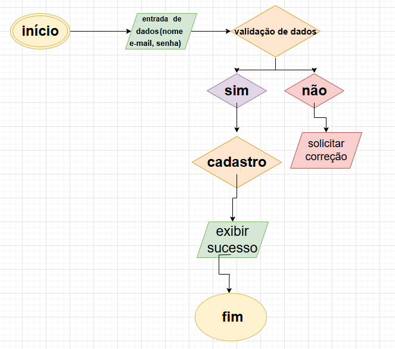
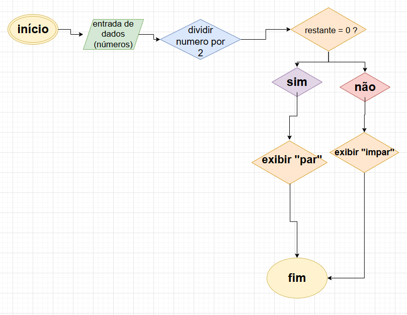

# Tarefa de Pesquisa: Fluxogramas na Área de Desenvolvimento de Sistemas e Lógica de Programação

🎯 Objetivo

Compreender a importância e a utilização dos fluxogramas no desenvolvimento de sistemas e na lógica de programação


# __Fluxogramas na Área de Desenvolvimento de Sistemas e Lógica de Programação__


- ### *O que é um fluxograma em lógica de programação?*

Um fluxograma é um diagrama que descreve um processo, sistema ou algoritmo de computador. São amplamente utilizados em várias áreas para documentar, estudar, planejar, melhorar e comunicar processos complexos por meio de diagramas claros e fáceis de entender.


- ### __*Principais símbolos utilizados e seus significados.*__

__Os fluxogramas utilizam símbolos padronizados para representar algoritmos de forma visual, facilitando o entendimento da lógica por trás de um algoritmo.__

-Fluxogramas representam algoritmos graficamente

-Utilizam símbolos padronizados para representar algoritmos visualmente

-Facilitam o entendimento da lógica por trás de um algoritmo


### __Principais símbolos utilizados em fluxogramas__


-Início/Fim: representado por um retângulo arredondado, indicando o começo e término do fluxograma

-Entrada de dados: indicada por um retângulo ‘quebrado’ na lateral, utilizado quando o usuário precisa inserir algum dado

-Saída de dados: representada por um retângulo ondulado na base, utilizado para exibir dados e resultados para o usuário

-Processamento: indicado por um retângulo simples, utilizado para operações de cálculo e processamento

-Decisão: representada por um losango, indicando uma condicional onde o fluxo segue por caminhos diferentes baseado em uma condição


### __Como os fluxogramas são utilizados no desenvolvimento de sistemas:__

__*Planejamento e Análise:*__ No início de um projeto, os fluxogramas ajudam a planejar e mapear os processos de forma visual. Isso facilita a comunicação entre a equipe de desenvolvimento, analistas e stakeholders.

 __*Desenvolvimento de Algoritmos:*__ Eles servem como guia para a construção de algoritmos, tornando o processo mais organizado. A visualização dos passos facilita identificar problemas e otimizar o processo.

__*Documentação:*__ Fluxogramas são uma excelente forma de documentar um sistema, pois fornecem uma visão clara do funcionamento do sistema ou do módulo que está sendo desenvolvido. Podem ser usados na documentação técnica de sistemas.

__*Depuração (Debugging):*__ Durante o processo de depuração, fluxogramas ajudam a verificar a lógica do código e identificar pontos onde ocorrem erros.


#### __Exemplos de fluxogramas aplicados à lógica de programação:__

__*Exemplo 1:*__ Fluxograma para somar dois números

*Este fluxograma descreve um processo simples para somar dois números fornecidos pelo usuário.*

- Início

- Entrada de dados: *Solicitar ao usuário que informe dois números.*

- Processamento: *Somar os dois números.*

- Saída: *Exibir o resultado da soma.*

- Fim


### Fluxograma:

```

[Início] --> [Entrada: Número 1, Número 2] --> [Processamento: Soma = Número 1 + Número 2] --> [Saída: Exibir Soma] --> [Fim] 
``` 

__*Exemplo 2:*__ Fluxograma para verificar se um número é par ou ímpar


*Este fluxograma descreve um processo para verificar se um número informado pelo usuário é par ou ímpar.*

- Início

- Entrada de dado: *Solicitar ao usuário um número.*

- Processamento: *Verificar se o número é divisível por 2.*

- Se sim, o número é par.

- Se não, o número é ímpar.

- Saída: *Exibir se o número é par ou ímpar.*

- Fim


### Fluxograma:

```
[Início] --> [Entrada: Número] --> [Processamento: Número % 2 == 0?]
     |                          |
   Sim                         Não
     |                          |
[Saída: Par]              [Saída: Ímpar]
     |
[End]

```

*Esses fluxogramas representam fluxos de controle simples, mas podem ser estendidos e usados em processos mais complexos com várias condições e loops, como em sistemas de recomendação ou gerenciamento de banco de dados.*


- ### *Ferramentas para criar fluxogramas*


Existem diversas ferramentas disponíveis para a criação de fluxogramas, que variam em termos de funcionalidades e usabilidade. Entre as opções, destacam-se plataformas online e ferramentas instaladas no computador, cada uma com suas vantagens e peculiaridades.

__Miro:__ plataforma online que permite a criação colaborativa de fluxogramas com interface amigável


__Draw.io:__ plataforma online com interface intuitiva para criar fluxogramas e outros diagramas

__Microsoft Visio:__ ferramenta robusta e completa para criação de diagramas e fluxogramas, necessitando de instalação no computador

## __*Imagens dos fluxogramas criados*__

__Fluxo de cadastro de usuário:__

[]

*Depois da entrada dos dados, é feita uma validação, se esses dados são validos, vai ser exibido o acesso, mas se não forem validos, vai ser solicitado correção.*


__Algoritmo para verificar se um número é par ou ímpar:__



*Quando feita a entrada de dados, os números são divididos po 2, se o resultado da conta for igual a 0, o número é par, se o resultado não for igual a 0, é impar.*

## __Conclusão:__
### os fluxogramas desempenham um papel crucial na estruturação e organização do trabalho no desenvolvimento de sistemas e processos. Eles são úteis para evitar falhas de comunicação, reduzir erros, otimizar processos e melhorar o entendimento geral entre as partes envolvidas.


